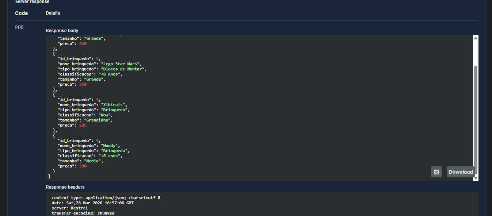
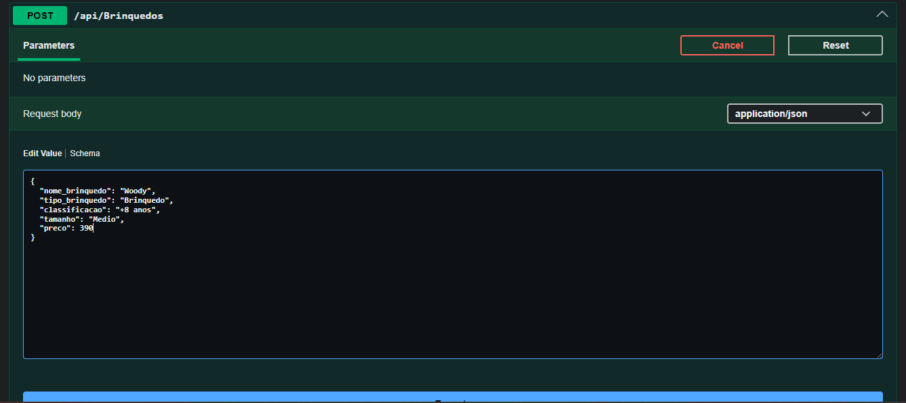
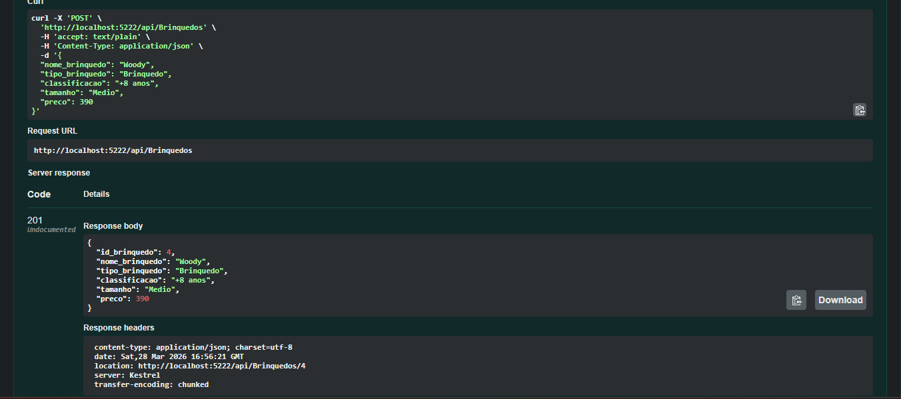
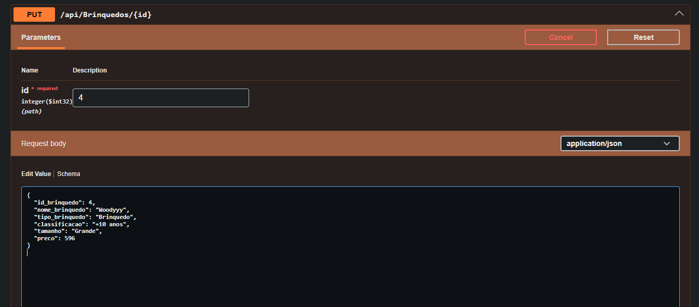
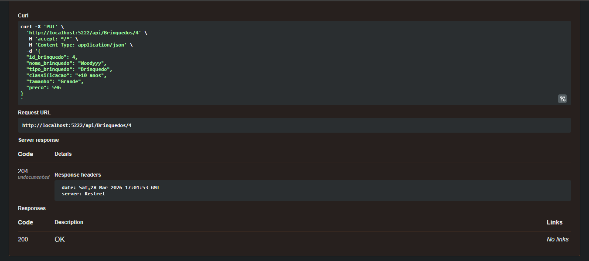
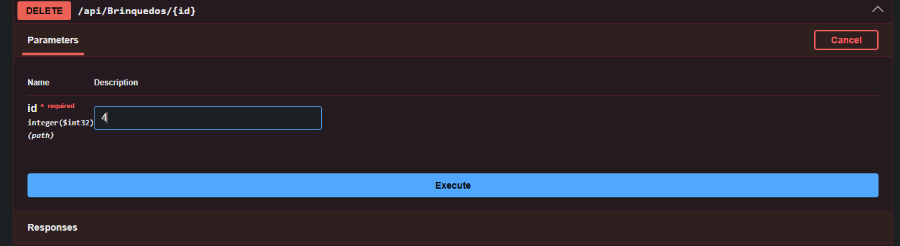
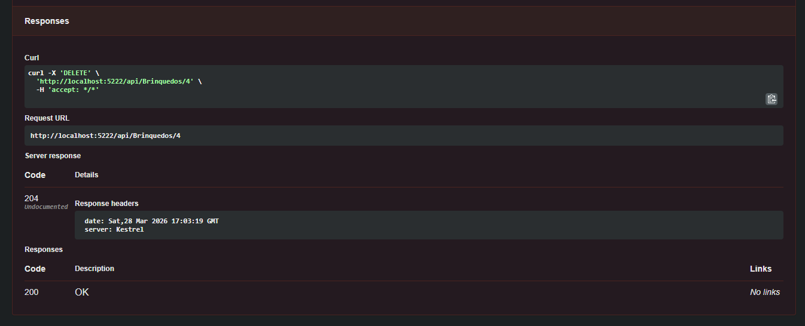
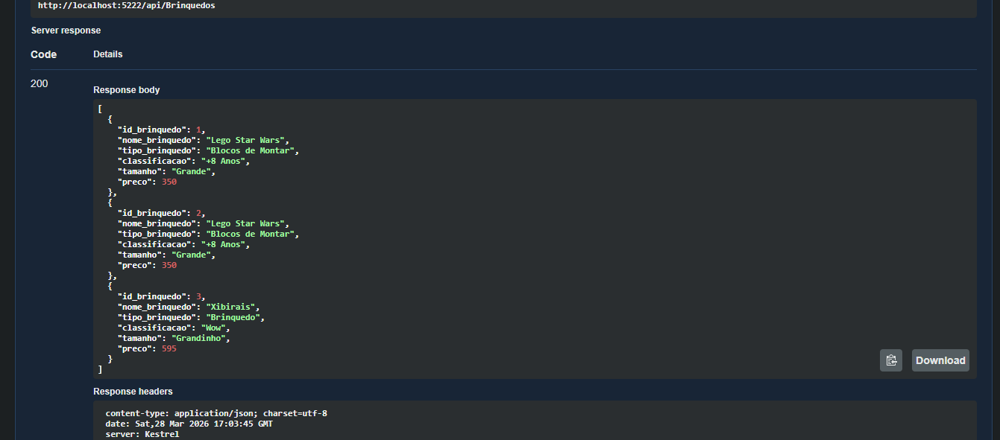
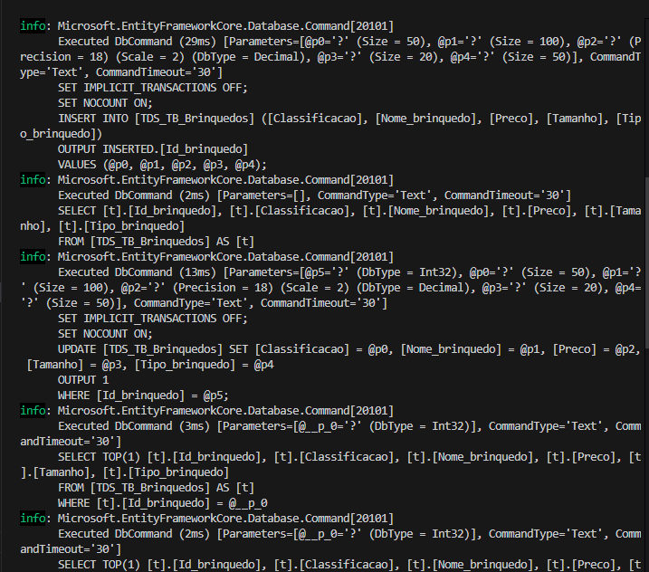
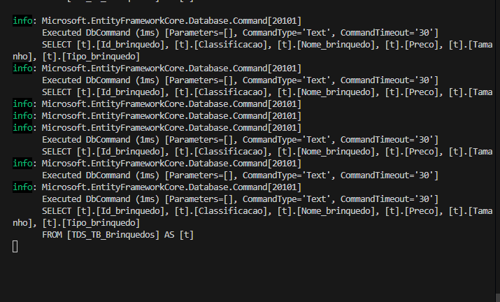

# Checkpoint 4 - Programação de API com BD, Swagger e Testes Unitários

Este é o projeto para a empresa de brinquedos (crianças até 14 anos), utilizando Entity Framework Core, SQL Server (via LocalDB) e possuindo endpoints para operações CRUD documentados pelo Swagger.

## Integrantes
- Gustavo Ramos (RM: 561055)
- Gustavo Dantas (RM: 560685)
- Arthur Henrique (RM: 560820)
- Davi Vasconcelos (RM: 559906)

## Tecnologias Utilizadas
- .NET 9 (C#)
- Entity Framework Core 9 (SQL Server & InMemory para testes)
- Swagger (Swashbuckle)
- xUnit (Testes Unitários)

## Como executar

1. Abra um terminal na pasta onde o arquivo `BrinquedosShop.sln` ou `BrinquedosAPI.csproj` está localizado.
2. Rode o comando para baixar e atualizar os pacotes (se necessário):
   ```bash
   dotnet restore
   ```
3. Execute o projeto API:
   ```bash
   dotnet run --project BrinquedosAPI --launch-profile "https"
   ```
4. Ao abrir, acesse `https://localhost:<porta>/swagger` para visualizar a interface do Swagger.

O projeto utiliza `LocalDB` (Microsoft SQL Server Express LocalDB) para persistência de dados. O próprio código (`Program.cs`) possui uma diretiva `context.Database.EnsureCreated()` implementada. Isso significa que **toda a estrutura do banco e a tabela de brinquedos são criadas automaticamente assim que a API roda a primeira vez no terminal**. 
Para os testes unitários da aplicação, usamos a versão `InMemory` das ferramentas do EF.

## Documentação dos Endpoints (Testes com Postman/Insomnia)

### Exemplo de JSON para Cadastro de Brinquedo (POST / PUT)
```json
{
  "nome_brinquedo": "Lego Star Wars",
  "tipo_brinquedo": "Blocos de Montar",
  "classificacao": "+8 Anos",
  "tamanho": "Grande",
  "preco": 350.00
}
```

### GET /api/Brinquedos


### POST /api/Brinquedos



### PUT /api/Brinquedos/{id}




### DELETE /api/Brinquedos/{id}




## Testes Unitários

O projeto `BrinquedosAPI.Tests` contém 5 métodos de teste configurados e testando toda a API Controller.
Para executar os testes:
```bash
dotnet test
```

### Resultados dos Testes

